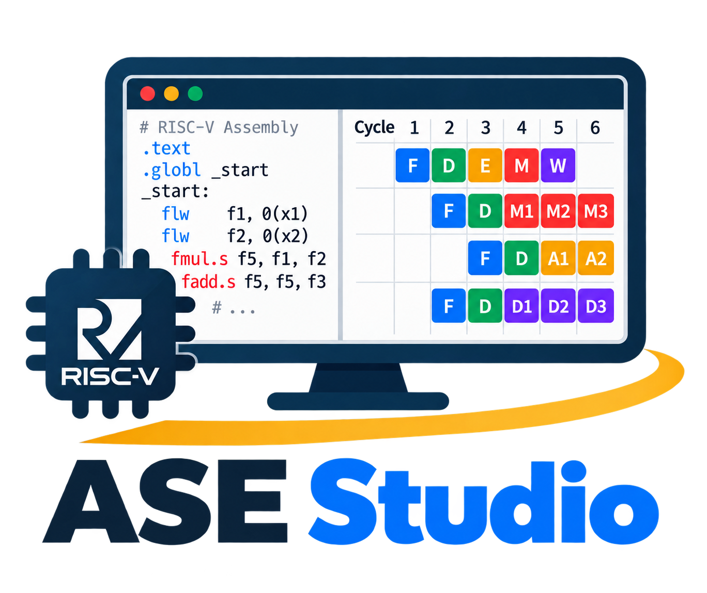

# ASE Studio

<p align="center">
  <picture>
    <source media="(prefers-color-scheme: dark)" srcset="frontend/ase_dark.png">
    
  </picture>
</p>


ASE Studio is a free educational application for learning RISC-V assembly,
processor hazards, memory behavior, and instruction pipelines. 

The simulation backend is based on the open-source gem5 architectural
simulator. The five-stage RISC-V pipeline model builds on modifications
developed by contributors to the
[ase_riscv_gem5_sim](https://github.com/cad-polito-it/ase_riscv_gem5_sim)
project.

Contributions are welcome. Feel free to
[open an issue](https://github.com/cad-polito-it/ase-studio/issues), submit a
pull request, or [contact us](mailto:behnam.farnaghinejad@polito.it).

## Installation

ASE Studio is designed to live at `ase_studio/` as a Git submodule of the
simulator repository. Clone the parent repository with its submodules:

```bash
git clone --recurse-submodules https://github.com/cad-polito-it/ase_riscv_gem5_sim.git
cd ase_riscv_gem5_sim
```

The unified installer supports Ubuntu, Fedora, and Arch Linux. Run it without
an argument for an interactive menu:

```bash
./utils/installation.sh
```

It can also install individual components or a complete frontend explicitly:

```text
./utils/installation.sh toolchain
./utils/installation.sh gem5
./utils/installation.sh ase-studio
./utils/installation.sh qt-visualizer
./utils/installation.sh all-ase
./utils/installation.sh all-qt
```

`all-ase` installs the RISC-V toolchain, gem5, and ASE Studio. `all-qt`
installs the same simulator dependencies with the Qt visualizer. The
installer updates the portable paths and selected frontend in `setup_default`.

## License and educational use

This project is intended for education and research. The repository is
distributed under the
[GNU General Public License version 2](https://github.com/cad-polito-it/ase-studio/blob/main/LICENSE);
redistribution and modification must follow that license. gem5 components
retain their upstream copyright and license notices. The software is provided
without warranty.

##

<p align="center">
  <a href="https://www.polito.it/"><picture><source media="(prefers-color-scheme: dark)" srcset="frontend/polito_dark.png"></picture></a>
  &nbsp;&nbsp;&nbsp;
  <a href="https://cad.polito.it/"><picture><source media="(prefers-color-scheme: dark)" srcset="frontend/cad-dark.webp"></picture></a>
</p>

<p align="center"><small>© Politecnico di Torino 2026</small></p> 
