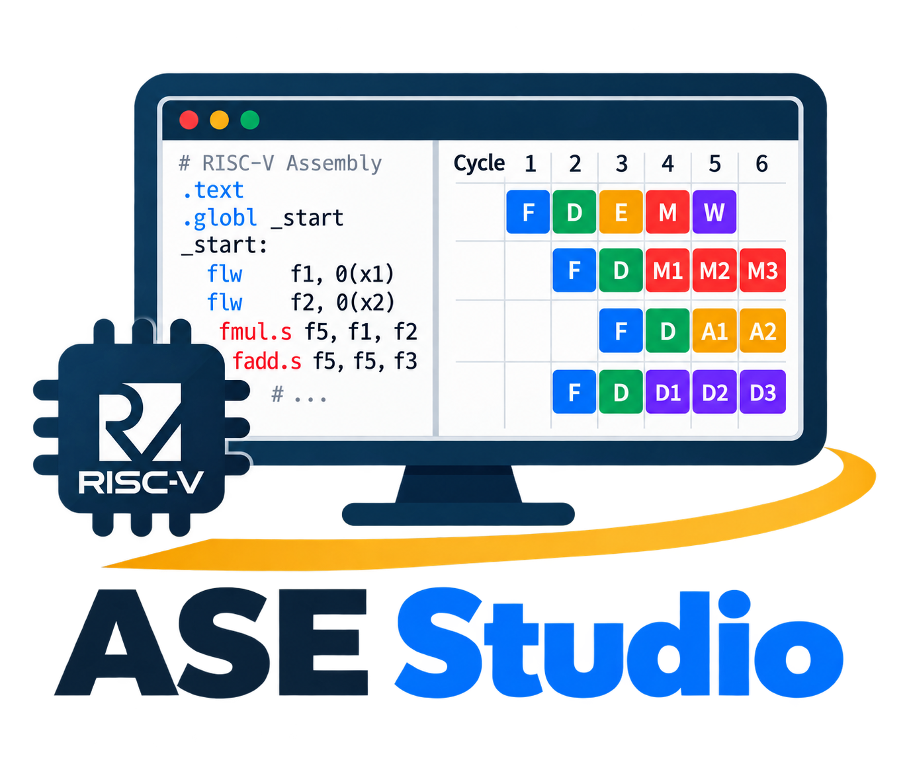

# ASE Studio

<p align="center">
  <picture>
    <source media="(prefers-color-scheme: dark)" srcset="frontend/ase_dark.png">
    
  </picture>
</p>


ASE Studio is a free educational application for learning RISC-V assembly,
processor hazards, memory behavior, and instruction pipelines.

The simulation backend is based on the open-source gem5 architectural
simulator. The five-stage RISC-V pipeline model builds on modifications
developed by contributors to the
[ase_riscv_gem5_sim](https://github.com/cad-polito-it/ase_riscv_gem5_sim)
project.
The modified simulator source is maintained in the CAD group's
[gem5 repository](https://github.com/cad-polito-it/gem5).

Contributions are welcome. Feel free to
[open an issue](https://github.com/cad-polito-it/ase-studio/issues), submit a
pull request, or [contact us](mailto:behnam.farnaghinejad@polito.it).

## Installation

ASE Studio is designed to live at `ase_studio/` as a Git submodule of the
simulator repository. Clone the parent repository with its submodules:

```bash
git clone --branch main --recurse-submodules https://github.com/cad-polito-it/ase_riscv_gem5_sim.git
cd ase_riscv_gem5_sim
```

The unified installer supports Ubuntu, Fedora, and Arch Linux. Run it without
an argument for an interactive menu:
 
```bash
./utils/installation.sh
```

It can also install individual components or a complete frontend explicitly:

```text
./utils/installation.sh toolchain
./utils/installation.sh gem5
./utils/installation.sh ase-studio
./utils/installation.sh labinf
./utils/installation.sh visualizer
./utils/installation.sh all-ase
./utils/installation.sh all-qt
```

`all-ase` installs the RISC-V toolchain, gem5, and ASE Studio. `all-qt`
installs the same simulator dependencies with the Qt visualizer. The
installer updates the portable paths and selected frontend in `setup_default`.

On a LabInf workstation, the required compiler, gem5 build, and GUI runtime
are already installed. Run `./utils/installation.sh labinf` after cloning to
copy the paths from `setup_default.labinf` into `setup_default` and create the
ASE Studio application-menu and desktop launchers without reinstalling tools.

ASE Studio has no third-party pip dependencies; its backend uses the Python
standard library. The native window requires Python 3, PyGObject, GTK 3, and
WebKitGTK 4.1. Running the submodule installer directly installs and verifies
these packages on Ubuntu/Debian, Fedora, or Arch/Manjaro:

```bash
./ase_studio/install.sh
```

The installer adds ASE Studio to the current user's application menu. When a
desktop directory is available, it also creates a trusted `ASE Studio.desktop`
shortcut there.

## Running on macOS (Apple Silicon)

The simulator tools and the native window are Linux-only, so on a Mac ASE
Studio runs inside a lightweight Ubuntu 22.04 machine managed by
[OrbStack](https://orbstack.dev) and is used from a Mac browser. The machine is
native arm64, so nothing runs under x86 emulation.

Requirements: an Apple Silicon Mac, OrbStack, and about 10 GB of free disk.

1. Install OrbStack and open it once:

   ```bash
   brew install --cask orbstack
   ```

2. Get this repository on the Mac (only `macos.sh` is used there):

   ```bash
   git clone https://github.com/cad-polito-it/ase-studio.git
   cd ase-studio
   ```

3. Create the Linux machine and install everything inside it. This compiles
   the RISC-V toolchain and gem5 from source and takes 30-90 minutes:

   ```bash
   ./macos.sh setup
   ```

4. Start ASE Studio. It opens `http://localhost:8765` in your browser:

   ```bash
   ./macos.sh start
   ```

Use `./macos.sh stop`, `restart`, `status`, or `logs` to manage the server.
`start` also boots OrbStack and the machine when they are stopped.

Projects, results, and submissions live inside the machine under
`~/ase_riscv_gem5_sim`. From macOS they are reachable in Finder at
`~/OrbStack/ase/home/<user>/ase_riscv_gem5_sim`. Submissions are also
downloaded by the browser when they are created. Actions that open Linux
desktop applications, such as **Open with…** and the tool installers in
Settings, are not available in the browser.

## License and educational use

This project is intended for education and research. The repository is
distributed under the
[GNU General Public License version 2](https://github.com/cad-polito-it/ase-studio/blob/main/LICENSE);
redistribution and modification must follow that license. gem5 components
retain their upstream copyright and license notices. The software is provided
without warranty.

##

<p align="center">
  <a href="https://www.polito.it/"><picture><source media="(prefers-color-scheme: dark)" srcset="frontend/polito_dark.png"></picture></a>
  &nbsp;&nbsp;&nbsp;
  <a href="https://cad.polito.it/"><picture><source media="(prefers-color-scheme: dark)" srcset="frontend/cad-dark.webp"></picture></a>
</p>

<p align="center"><small>© Politecnico di Torino 2026</small></p> 
